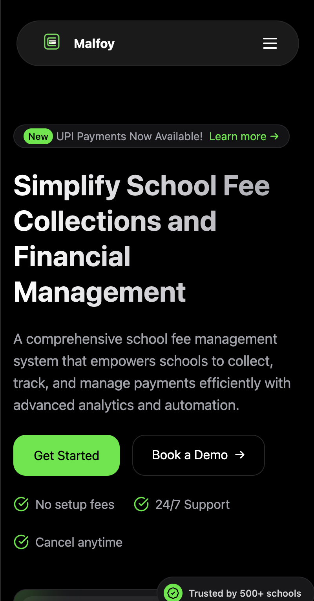

# Edviron School Fee Management System

A comprehensive system for schools to manage fee collections, payments, and financial analytics.

<p align="center">
  
</p>


<p align="center">
  
</p>


## Mobile View

<p align="center">
  
</p>


[Watch Demo Video](https://drive.google.com/file/d/1YIGTznCTZk4CVkcLRADq8sK1DrNag82w/view?usp=sharing)

## Project Overview

Edviron is a full-stack application designed to simplify school fee management with a beautiful user interface and robust backend. The system helps educational institutions collect, track, and manage payments efficiently with advanced analytics and automation.

### Key Features

- **Multi-channel Payments**: UPI, cards, net banking, and offline methods
- **Real-time Analytics**: Comprehensive dashboards with financial insights
- **Fee Structure Management**: Complex fee structures with components, discounts, and scholarships
- **Parent Portal**: Simple interface for parents to view and make payments
- **Automated Reminders**: SMS, email, and WhatsApp notifications
- **Instant Reconciliation**: Automatic payment processing with digital receipts

## Repository Structure

The repository is organized into two main parts:

- [**Frontend**](./fe/README.md): Next.js application with a modern UI
- [**Backend**](./backend/README.md): Node.js/Express API with MongoDB database

## Tech Stack

### Frontend
- Next.js
- Tailwind CSS
- Motion for animations
- Lucide Icons

### Backend
- Node.js with Bun runtime
- Express.js
- MongoDB with Prisma ORM
- JWT authentication

## Quick Start

### Prerequisites
- Node.js 18.x or later
- Bun runtime (for backend)
- MongoDB connection

### Frontend Setup
```bash
cd fe
npm install
npm run dev
```
Frontend will be available at http://localhost:3000

### Backend Setup
```bash
cd backend
bun install
bunx prisma generate
bun dev
```
API will be available at http://localhost:4000

### Docker Compose (Both Services)
```bash
docker-compose up -d
```

## Environment Setup

Create appropriate `.env` files in both frontend and backend directories. See the respective READMEs for details.

## Deployment

The system is designed for easy deployment with Docker. See the detailed deployment instructions in each project's README.

## Screenshots


## Contributing

Contributions are welcome! Please check out our [contributing guidelines](CONTRIBUTING.md).


## Acknowledgements

- [Edviron Team](https://edviron.itsyash.space)
- All the open source libraries and frameworks used in this project 